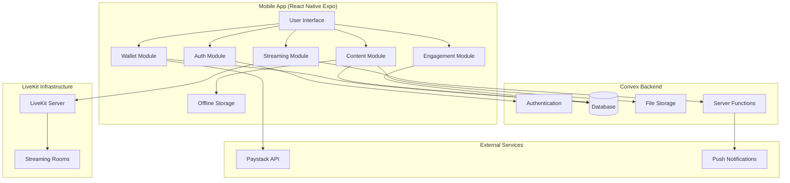
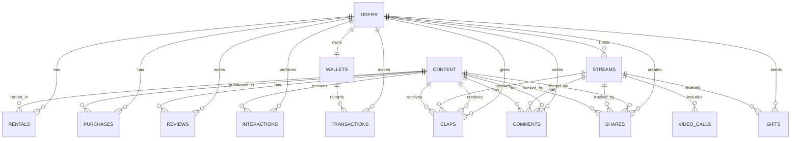

# VideoClub App - Design Document

## Overview

VideoClub is a React Native Expo mobile application that recreates the nostalgic video rental experience for the digital age, focusing on Nollywood content and Nigerian music. The application provides a comprehensive platform for content consumption (movies and music), live streaming with celebrity interactions, and community engagement through reviews and recommendations.

The system is built on a modern serverless architecture leveraging:
- **Convex** for backend services (database, authentication, file storage, real-time synchronization)
- **LiveKit** for real-time video streaming and video calls
- **Paystack** for payment processing
- **React Native Expo** for cross-platform mobile development

The application implements a phased rollout strategy to ensure stable, incremental delivery of features while maintaining quality and user experience.

## Architecture

### High-Level Architecture



### System Components

#### 1. Mobile Application Layer (React Native Expo)
- **Authentication Module**: Handles user registration, login, logout, and session management
- **Content Module**: Manages movie rentals, music purchases, downloads, and offline playback
- **Streaming Module**: Handles live stream viewing, video calls, and real-time interactions
- **Wallet Module**: Manages wallet balance, transactions, and payment processing
- **Recommendation Module**: Displays personalized content suggestions
- **Community Module**: Handles reviews, ratings, and user interactions
- **Engagement Module**: Manages claps, comments, and sharing for content and live streams
- **Notification Module**: Manages push notifications and in-app alerts

#### 2. Convex Backend Layer
- **Authentication Service**: User identity management with JWT tokens
- **Database**: Stores users, content metadata, transactions, reviews, and interactions
- **File Storage**: Stores movies, music, music videos, and stream replays
- **Server Functions**: Business logic for transactions, recommendations, and content management
- **Real-time Subscriptions**: Live data updates for wallet balance, stream status, and notifications

#### 3. LiveKit Streaming Layer
- **Live Streaming**: Handles celebrity broadcasts with adaptive bitrate
- **Video Calls**: Manages surprise video calls between celebrities and viewers
- **Room Management**: Creates and manages streaming rooms with participant controls

#### 4. External Services
- **Paystack**: Payment gateway for wallet top-ups
- **Expo Push Notifications**: Delivers notifications to mobile devices

### Data Flow Patterns

#### Content Rental Flow
1. User selects content → Check wallet balance (Convex)
2. Deduct payment → Create rental record (Convex transaction)
3. Generate download URL → Download to device storage
4. Schedule auto-delete → Set 3-day timer
5. Update recommendations → Record interaction

#### Live Streaming Flow
1. Celebrity starts stream → Create LiveKit room
2. Generate access tokens → Distribute to viewers
3. Stream video → LiveKit handles distribution
4. User sends gift → Convex processes transaction
5. Update earnings → Real-time sync to celebrity
6. Stream ends → Save replay to Convex storage

#### Surprise Video Call Flow
1. Celebrity selects viewer → Send notification (Convex)
2. Viewer accepts → Join LiveKit room
3. Establish video connection → Visible to all viewers
4. Call ends → Return to normal stream

#### Content Engagement Flow
1. User claps content → Record clap (Convex transaction)
2. Update engagement metrics → Real-time sync to all viewers
3. User comments → Validate and store (Convex)
4. Display comment → Real-time sync to all viewers
5. User shares → Generate shareable link
6. Track share → Record in Convex

#### Content Engagement Flow
1. User views content → Display engagement metrics (Convex query)
2. User claps → Create clap record (Convex mutation)
3. Update clap count → Real-time sync to all viewers
4. User adds comment → Validate and store (Convex)
5. Display comment → Real-time update to all viewers
6. User shares → Generate share link and record action
7. Track engagement → Update recommendation engine

## Components and Interfaces

### Mobile App Components

#### Authentication Components
```typescript
interface AuthService {
  signUp(email: string, phone: string, password: string, interests: string[]): Promise<User>;
  signIn(email: string, password: string): Promise<User>;
  signOut(): Promise<void>;
  updateProfile(userId: string, updates: Partial<UserProfile>): Promise<User>;
  getCurrentUser(): User | null;
}

interface User {
  id: string;
  email: string;
  phone: string;
  displayName: string;
  interests: string[];
  isVerified: boolean;
  isCelebrity: boolean;
  createdAt: number;
}
```

#### Content Components
```typescript
interface ContentService {
  getMovies(filters?: ContentFilters): Promise<Movie[]>;
  getMusic(filters?: ContentFilters): Promise<Music[]>;
  rentMovie(movieId: string): Promise<Rental>;
  purchaseMusic(musicId: string): Promise<Purchase>;
  downloadContent(contentId: string): Promise<void>;
  getOfflineLibrary(): Promise<OfflineContent[]>;
  deleteOfflineContent(contentId: string): Promise<void>;
}

interface Movie {
  id: string;
  title: string;
  genre: string[];
  duration: number;
  price: number; // 50 or 100 Naira
  isBlockbuster: boolean;
  thumbnailUrl: string;
  fileUrl: string;
  description: string;
  releaseYear: number;
  rating: number;
  reviewCount: number;
}

interface Music {
  id: string;
  title: string;
  artist: string;
  album?: string;
  genre: string[];
  duration: number;
  price: number; // 50, 100, or 500 Naira
  type: 'track' | 'album' | 'video';
  thumbnailUrl: string;
  fileUrl: string;
  rating: number;
  reviewCount: number;
}

interface Rental {
  id: string;
  userId: string;
  contentId: string;
  rentedAt: number;
  expiresAt: number;
  isActive: boolean;
}
```

#### Wallet Components
```typescript
interface WalletService {
  getBalance(): Promise<number>;
  addFunds(amount: number): Promise<PaymentSession>;
  getTransactionHistory(): Promise<Transaction[]>;
  processPayment(amount: number, purpose: string, metadata: any): Promise<Transaction>;
}

interface Transaction {
  id: string;
  userId: string;
  amount: number;
  type: 'credit' | 'debit';
  purpose: string;
  status: 'pending' | 'completed' | 'failed';
  timestamp: number;
  metadata: any;
}

interface PaymentSession {
  sessionId: string;
  paystackUrl: string;
  amount: number;
}
```

#### Streaming Components
```typescript
interface StreamingService {
  startStream(streamConfig: StreamConfig): Promise<LiveStream>;
  joinStream(streamId: string): Promise<StreamSession>;
  endStream(streamId: string): Promise<void>;
  sendGift(streamId: string, giftType: GiftType, amount: number): Promise<void>;
  initiateVideoCall(streamId: string, viewerId: string): Promise<VideoCall>;
  acceptVideoCall(callId: string): Promise<void>;
}

interface LiveStream {
  id: string;
  celebrityId: string;
  title: string;
  startedAt: number;
  viewerCount: number;
  liveKitRoomName: string;
  liveKitToken: string;
  status: 'live' | 'ended';
}

interface StreamSession {
  streamId: string;
  liveKitToken: string;
  roomName: string;
}

interface VideoCall {
  id: string;
  streamId: string;
  celebrityId: string;
  viewerId: string;
  status: 'pending' | 'active' | 'ended' | 'declined';
  liveKitToken: string;
}

type GiftType = 'emoji' | 'spray';
```

#### Recommendation Components
```typescript
interface RecommendationService {
  getRecommendations(userId: string): Promise<Content[]>;
  recordInteraction(userId: string, contentId: string, interactionType: InteractionType): Promise<void>;
  updatePreferences(userId: string, preferences: string[]): Promise<void>;
}

type InteractionType = 'view' | 'rent' | 'purchase' | 'review' | 'search';

interface Content {
  id: string;
  type: 'movie' | 'music';
  title: string;
  thumbnailUrl: string;
  price: number;
  rating: number;
  recommendationScore: number;
}
```

#### Community Components
```typescript
interface CommunityService {
  submitReview(contentId: string, rating: number, comment: string): Promise<Review>;
  getReviews(contentId: string): Promise<Review[]>;
  flagReview(reviewId: string, reason: string): Promise<void>;
}

interface Review {
  id: string;
  userId: string;
  contentId: string;
  rating: number;
  comment: string;
  timestamp: number;
  flagCount: number;
}
```

#### Engageonents
```typ
nterface gementService {
  clapContent(contentId: string, contentType: 'movie' | 'music' | 'stream'): Promise<void>;
  unclapContent(contentId: string, contentType: 'movie' | 'music' | 'stream'): Promise<void>;
  submitComment(contentId: string, contentType: 'movie' | 'music' | 'stream', comment: string): Promise<Comment>;
  getComments(contentId: string, contentType: 'movie' | 'music' | 'stream'): Promise<Comment[]>;
  shareContent(contentId: string, contentType: 'movie' | 'music' | 'stream'): Promise<ShareLink>;
  getEngagementMetrics(contentId: string, contentType: 'movie' | 'music' | 'stream'): Promise<EngagementMetrics>;
  flagComment(commentId: string, reason: string): Promise<void>;
  hasUserClapped(contentId: string, userId: string): Promise<boolean>;
}

interface Comment {
  id: string;
  userId: string;
  userName: string;
  userAvatar?: string;
  contentId: string;
  contentType: 'movie' | 'music' | 'stream';
  text: string;
  timestamp: number;
  flagCount: number;
}

interface EngagementMetrics {
  contentId: string;
  clapCount: number;
  commentCount: number;
  shareCount: number;
  userHasClapped: boolean;
}

interface ShareLink {
  url: string;
  contentId: string;
  contentType: 'movie' | 'music' | 'stream';
  shareId: string;
}
```
#### Engagement Components
```typescript
interface EngagementService {
  clapContent(contentId: string): Promise<EngagementMetrics>;
  unclapContent(contentId: string): Promise<EngagementMetrics>;
  addComment(contentId: string, commentText: string): Promise<Comment>;
  getComments(contentId: string): Promise<Comment[]>;
  shareContent(contentId: string): Promise<ShareLink>;
  flagComment(commentId: string, reason: string): Promise<void>;
  getEngagementMetrics(contentId: string): Promise<EngagementMetrics>;
}

interface EngagementMetrics {
  contentId: string;
  clapCount: number;
  commentCount: number;
  shareCount: number;
  userHasClapped: boolean;
}

interface Comment {
  id: string;
  userId: string;
  contentId: string;
  text: string;
  timestamp: number;
  flagCount: number;
  userDisplayName: string;
}

interface ShareLink {
  contentId: strmber;
}
```
x Backend Sche
  flagCount:g;
  timesta{
 use rId: s id: st Schema

#### Database Tables

```typescript
// users table
{
  _id: Id<"users">,
  email: string,
  phone: string,
  displayName: string,
  interests: string[],
  isVerified: boolean,
  isCelebrity: boolean,
  verificationStatus?: 'pending' | 'approved' | 'rejected',
  verificationData?: {
    socialLinks: string[],
    credentials: string[]
  },
  createdAt: number
}

// content table
{
  _id: Id<"content">,
  type: 'movie' | 'music_track' | 'music_album' | 'music_video',
  title: string,
  description: string,
  genre: string[],
  price: number,
  isBlockbuster?: boolean,
  duration: number,
  fileStorageId: Id<"_storage">,
  thumbnailStorageId: Id<"_storage">,
  uploaderId: Id<"users">,
  releaseYear?: number,
  artist?: string,
  album?: string,
  rating: number,
  reviewCount: number,
  isClassic: boolean,
  createdAt: number
}

// wallets table
{
  _id: Id<"wallets">,
  userId: Id<"users">,
  balance: number,
  updatedAt: number
}

// transactions table
{
  _id: Id<"transactions">,
  userId: Id<"users">,
  amount: number,
  type: 'credit' | 'debit',
  purpose: string,
  status: 'pending' | 'completed' | 'failed',
  metadata: any,
  timestamp: number
}

// rentals table
{
  _id: Id<"rentals">,
  userId: Id<"users">,
  contentId: Id<"content">,
  rentedAt: number,
  expiresAt: number,
  isActive: boolean
}

// purchases table
{
  _id: Id<"purchases">,
  userId: Id<"users">,
  contentId: Id<"content">,
  purchasedAt: number,
  amount: number
}

// reviews table
{
  _id: Id<"reviews">,
  userId: Id<"users">,
  contentId: Id<"content">,
  rating: number,
  comment: string,
  timestamp: number,
  flagCount: number
}

// interactions table
{
  _id: Id<"interactions">,
  userId: Id<"users">,
  contentId: Id<"content">,
  type: 'view' | 'rent' | 'purchase' | 'review' | 'search',
  timestamp: number
}

// streams table
{
  _id: Id<"streams">,
  celebrityId: Id<"users">,
  title: string,
  liveKitRoomName: string,
  startedAt: number,
  endedAt?: number,
  status: 'scheduled' | 'live' | 'ended',
  viewerCount: number,
  totalEarnings: number,
  replayStorageId?: Id<"_storage">
}

// gifts table
{
  _id: Id<"gifts">,
  streamId: Id<"streams">,
  userId: Id<"users">,
  celebrityId: Id<"users">,
  amount: number,
  type: 'emoji' | 'spray',
  timestamp: number
}

// video_calls table
{
  _id: Id<"video_calls">,
  streamId: Id<"streams">,
  celebrityId: Id<"users">,
  viewerId: Id<"users">,
  status: 'pending' | 'active' | 'ended' | 'declined',
  initiatedAt: number,
  endedAt?: number
}

// notifications table
{
  _id: Id<"notifications">,
  userId: Id<"users">,
  type: string,
  title: string,
  message: string,
  data: any,
  isRead: boolean,
  timestamp: number
}

// claps table
{
  _id: Id<"claps">,
  userId: Id<"users">,
  contentId: string,
  contentType: 'movie' | 'music' | 'stream',
  timestamp: number
}

// comments table
{
  _id: Id<"comments">,
  userId: Id<"users">,
  contentId: string,
  contentType: 'movie' | 'music' | 'stream',
  text: string,
  timestamp: number,
  flagCount: number
}

// shares table
{
  _id: Id<"shares">,
  userId: Id<"users">,
  contentId: string,
  contentType: 'movie' | 'music' | 'stream',
  shareId: string,
  timestamp: number
}

// engagement_metrics table
{
  _id: Id<"engagement_metrics">,
  contentId: string,
  contentType: 'movie' | 'music' | 'stream',
  clapCount: number,
  commentCount: number,
  shareCount: number,
  updatedAt: number
}

// claps table
{
  _id: Id<"claps">,
  userId: Id<"users">,
  contentId: string,
  contentType: 'content' | 'stream',
  timestamp: number
}

// comments table
{
  _id: Id<"comments">,
  userId: Id<"users">,
  contentId: string,
  contentType: 'content' | 'stream',
  text: string,
  timestamp: number
}

// shares table
{
  _id: Id<"shares">,
  uontentId: Id<ers">,
  contentId: number
}contentTynt' | 'stream',
```: string,
amp: numbe

### LiveKit Integration

#### Room Configuration
```typescript
interface LiveKitConfig {
  roomName: string;
  participantIdentity: string;
  participantName: string;
  metadata?: string;
}

interface TokenConfig {
  identity: string;
  name: string;
  roomName: string;
  canPublish: boolean;
  canSubscribe: boolean;
}
```

## Data Models

### Core Entities

#### User Entity
- **Purpose**: Represents all users (regular users and celebrities)
- **Key Attributes**: email, phone, displayName, interests, verification status
- **Relationships**: One-to-many with rentals, purchases, reviews, streams, gifts

#### Content Entity
- **Purpose**: Represents all rentable/purchasable content
- **Key Attributes**: type, title, price, fileStorageId, genre, rating
- **Relationships**: One-to-many with rentals, purchases, reviews, interactions

#### Wallet Entity
- **Purpose**: Stores user's current balance
- **Key Attributes**: userId, balance
- **Relationships**: One-to-one with user, one-to-many with transactions

#### Transaction Entity
- **Purpose**: Records all financial transactions
- **Key Attributes**: userId, amount, type, purpose, status
- **Relationships**: Many-to-one with user and wallet

#### Stream Entity
- **Purpose**: Represents live streaming sessions
- **Key Attributes**: celebrityId, liveKitRoomName, status, viewerCount, totalEarnings
- **Relationships**: One-to-many with gifts, video callsllsnd shares

#
lap**: Records user appreciation for content
- **Comment**: Stores user comments on content
- **Share**: Tracks content sharing actions
- **Engagement Metrics**: Aggregated engagement counts per content item
#### 
- **Key Aibutes**: userId, contentId, timestamp
- **Relationships**: Many-to-one with user and content

#### Comment Entity
- **Purpose**: Stores user comments on content
- **Key Attributes**: userId, contentId, text, timestamp, flagCount
- **Relationships**: Many-to-one with user and content

#### Share Entity
- **Purpose**: Tracks ce witontent sh user and contentharing actions
- **Key Attributes**: userId, contentId,mp
- **Relationships**: Ma
- **Purpose**: Records user appreciatent

### Data Relationships



## Correctness Properties

*A property is a characteristic or behavior that should hold true across all valid executions of a system—essentially, a formal statement about what the system should do. Properties serve as the bridge between human-readable specifications and machine-verifiable correctness guarantees.*

